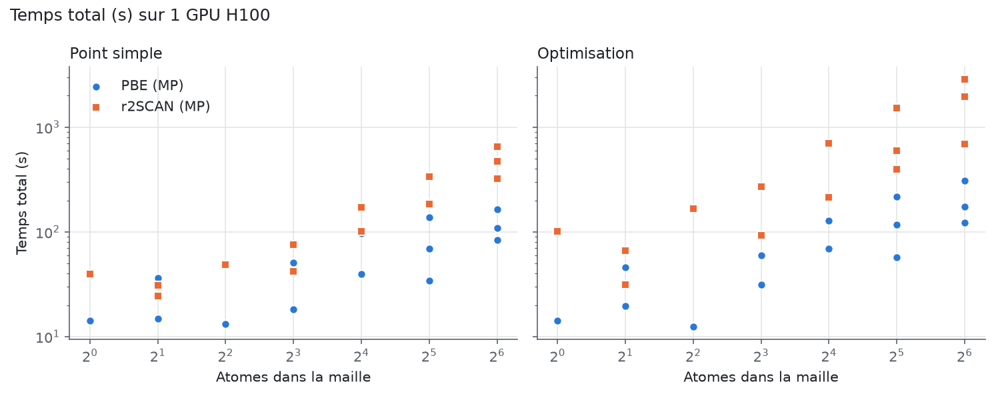
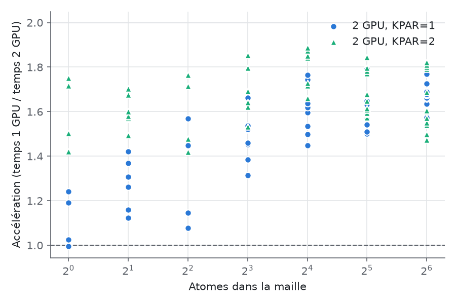
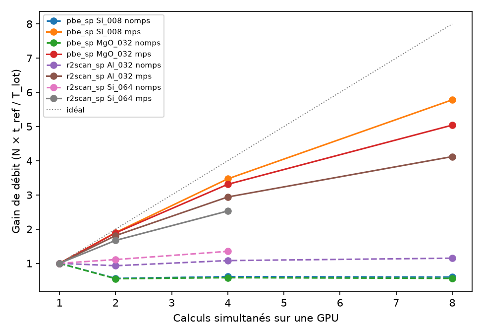

# Performances de VASP GPU sur vm1-ic2mp

Ce dépôt rassemble le protocole et les tableaux de résultats d'une étude de performance
de VASP 6.5.1 (version GPU) sur la machine partagée **vm1-ic2mp** (2 × NVIDIA H100).
Les calculs portent sur des structures de [Materials Project](https://next-gen.materialsproject.org)
de 1 à 80 atomes : séries d'échelle (Si, Al, MgO, de 1 à 64 atomes), puis jeu de diversité (34 composés, de 1 à 80 atomes), programmé. Deux types de calcul sont testés : point simple (single point) et optimisation
de géométrie. Chacun suit les deux méthodologies de Materials Project : **PBE** (GGA/GGA+U)
et **r2SCAN**.

> **État au 01/10/2026 :** phases 0 à 6 terminées (1 et 2 GPU, 14 structures × 4 séries, répétitions ;
> phonons PBE de Si, Al et MgO ; calculs simultanés sur une GPU avec et sans MPS, analysés) ;
> rapport complété d'une annexe donnant tous les INCAR utilisés.
> En cours : calibration de la dynamique moléculaire de LiN₃ (phase 7, étape 1) : AIMD `vasp_gam` terminée ;
> AIMD `vasp_std` interrompue au pas 64 (job remis en file le 28/09), puis relâchée le 01/10 avec les deux
> calculs MLFF qui la suivent ; les trois jobs attendent qu'un GPU se libère.
> Soumise le 01/10 : campagne test2 (effet de `NSIM = 32`, variante `g1`), placée avant les calculs MLFF.
> Programmé ensuite, dans cet ordre : production MLFF de LiN₃ (après analyse de la calibration),
> puis jeu de diversité, points simples (phase 8) et enfin optimisations (phase 9).

## Contenu du dépôt

| Dossier | Contenu |
|---|---|
| [`benchmark/`](benchmark/) | Scripts de l'étude : récupération des structures MP, génération des entrées, soumission Slurm, analyse. Installation : `benchmark/setup.sh` |
| [`vaspilot/`](vaspilot/) | **Mis de côté, hors de l'étude.** [VASPilot](https://github.com/JiaxuanLiu-Arsko/VASPilot) adapté à cette machine : agents qui pilotent VASP en langage naturel. Voir la note ci-dessous |
| [`results/`](results/) | Tableaux de résultats finaux, un par phase |
| [`report/`](report/) | Rapport en anglais (LaTeX et PDF, compilé avec `tectonic report/report.tex`) ; l'annexe A reproduit les INCAR de toutes les séries (MP, phonons, AIMD) |

Les calculs eux-mêmes (OUTCAR, etc.) ne sont pas versionnés : ils restent sur vm1-ic2mp.
Les POTCAR, sous licence VASP, ne sont jamais versionnés.

### VASPilot mis de côté

L'étude n'utilise pas VASPilot : les scripts de `benchmark/` suffisent et ne font appel à aucun LLM.
VASPilot demande un LLM. Avec une API en ligne, chaque tâche est facturée par le fournisseur, et les
consignes ainsi que les résultats renvoyés par les outils (structures, paramètres, énergies, chemins)
sortent de la machine. Un LLM local éviterait ces deux points, mais il occuperait l'un des deux GPU
partagés. L'adaptation reste dans `vaspilot/` pour un usage éventuel. Elle est installée sur la machine,
mais ses serveurs ne sont pas lancés et aucune clé LLM n'est configurée.

## Questions étudiées

1. Comment le temps de calcul évolue-t-il avec le nombre d'atomes, de 1 à 64 ?
2. Combien coûte r2SCAN par rapport à PBE, par pas SCF et au total ?
3. Combien coûte une optimisation complète par rapport à un point simple ?
4. Que rapporte le passage de 1 à 2 GPU, et vaut-il mieux répartir les points k (KPAR=2)
   ou les bandes et ondes planes (KPAR=1) ?
5. Quelle mémoire GPU faut-il selon la taille du système ?
6. Les temps sont-ils reproductibles d'un job à l'autre ?
7. Les énergies obtenues sont-elles cohérentes avec celles publiées par Materials Project ?

## Machine

| Élément | Valeur |
|---|---|
| GPU | 2 × NVIDIA H100 NVL, 94 Go chacun (pilote 595.84) |
| CPU | AMD EPYC 7662, 32 cœurs attribués à la VM |
| Mémoire | 62 Go |
| Ressources par GPU (Slurm) | 16 cœurs, ~28 Go de RAM, pas de limite de temps |
| Logiciel | VASP 6.5.1 (10 mars 2025), version GPU OpenACC compilée le 23/09/2026 (`vasp_std`, `vasp_gam`) ; NVHPC 26.3, OpenMPI HPC-X, Intel MKL |
| Exécution | 1 rang MPI par GPU, `OMP_NUM_THREADS=1` |

## Méthodes

Les entrées sont générées avec les jeux de paramètres de Materials Project implémentés dans
pymatgen, sans modification des paramètres physiques.

| Série | Jeu pymatgen | Paramètres principaux |
|---|---|---|
| `pbe_sp` | `MPStaticSet` | PBE, U de MP pour les oxydes et fluorures de Co, Cr, Fe, Mn, Mo, Ni, V ; ENCUT 520 eV ; 100 points k par Å⁻³ réciproque ; ISPIN 2 |
| `pbe_relax` | `MPRelaxSet` | idem, ISIF 3, ALGO Fast, 64 points k par Å⁻³ réciproque, EDIFF 5·10⁻⁵ eV par atome |
| `r2scan_sp` | `MPScanStaticSet` | METAGGA R2SCAN, ENCUT 680 eV, KSPACING de 0,22 à 0,44 Å⁻¹ selon le gap MP, EDIFF 10⁻⁵ |
| `r2scan_relax` | `MPScanRelaxSet` | idem, ISIF 3, ALGO All, EDIFFG −0,02 eV/Å |

Écarts à la méthodologie MP, identiques pour tous les calculs :

- **POTCAR** : le jeu PBE_54 installé sur la machine sert aussi pour PBE. MP utilise un jeu PBE
  plus ancien, identique pour presque tous les éléments. W_pv, absent, serait remplacé par W_sv.
  Pour les composés étudiés, seul Mg diffère : MP a utilisé `Mg_pv 06Sep2000` en PBE, contre
  `Mg_pv 13Apr2007` ici (et chez MP en r2SCAN), d'où un écart constant d'environ 60 meV/atome sur MgO en PBE.
- **Écritures désactivées** : WAVECAR, CHGCAR, AECCAR, LOCPOT et ELFCAR, pour mesurer le calcul
  et non les entrées/sorties.
- **Parallélisation** : NCORE est retiré, car la version GPU l'impose à 1. KPAR dépend de la variante.
- **Petites grilles** : quand la grille a moins de 4 points k, ISMEAR −5 (tétraèdres) est remplacé
  par ISMEAR 0 avec SIGMA 0,05, comme le fait custodian chez MP.

Les optimisations partent des structures MP, déjà relaxées en PBE. En PBE, elles convergent donc
en peu de pas. En r2SCAN, elles demandent quelques pas de plus. Les résultats donnent le temps
total et le temps par pas ionique.

## Composés

**Périmètre : les séries d'échelle (14 structures, phases 0 à 4), puis le jeu de diversité
(34 structures, phases 8 et 9, programmées après la dynamique moléculaire).**

### Séries d'échelle (retenues)

Un même matériau en supercellules de taille croissante. À chimie constante, on isole l'effet
du nombre d'atomes.

| Matériau | mp-id | Type | Tailles (atomes) |
|---|---|---|---|
| Si diamant | mp-149 | semi-conducteur | 2 (primitive), 8, 16, 32, 64 |
| Al cfc | mp-134 | métal | 1 (primitive), 4, 32, 64 |
| MgO sel gemme | mp-1265 | isolant | 2 (primitive), 8, 16, 32, 64 |

Au total, 14 structures. En supercellule, la densité de points k par atome est conservée, comme
dans la méthodologie MP : le nombre de points k diminue quand la maille grandit.

### Jeu de diversité (programmé, phases 8 et 9)

Des matériaux réels choisis dans Materials Project, pour couvrir des chimies et des tailles de
maille variées. Pour chaque taille (1, 2, 3, 4, 6, 8, 10, 12, 16, 20, 24, 32, 40, 48, 56, 64, 72
et 80 atomes), le script retient un non-métal (gap MP > 0,3 eV) et un métal (gap MP nul).

Critères de sélection :

- composés stables (sur l'enveloppe convexe de MP) ;
- au plus 4 éléments ;
- ni terres rares, ni actinides, ni gaz rares, ni W ;
- sélection déterministe : le plus petit mp-id qui remplit les critères.

Liste obtenue le 26/09/2026 avec `01_fetch_structures.py` (35 structures). Gaps en eV, en PBE, selon MP.

| Atomes | Non-métal (mp-id, gap) | Métal (mp-id) |
|---|---|---|
| 1 | aucun | Pd (mp-2) |
| 2 | Si (mp-149, 0,61), déjà dans la série d'échelle | Fe (mp-13), magnétique |
| 3 | CdF₂ (mp-241, 2,90) | Ti (mp-72) |
| 4 | PtS (mp-288, 0,38) | Be (mp-87) |
| 6 | Cu₂O (mp-361, 0,51) | SrIr₂ (mp-318) |
| 8 | N₂ (mp-154, 7,38) | GeIr (mp-208) |
| 10 | MgP₄ (mp-384, 0,73) | Ti₂O₃ (mp-458) |
| 12 | B (mp-160, 1,43) | BaZn₅ (mp-303) |
| 16 | KAs (mp-713, 0,67) | ReO₃ (mp-190) |
| 20 | MgB₄ (mp-365, 0,36) | Mg₃Ru₂ (mp-625) |
| 24 | SeO₂ (mp-726, 3,29) | NbSe₃ (mp-525) |
| 32 | S (mp-77, 2,58) | NaB₁₅ (mp-2315) |
| 40 | Ca₃N₂ (mp-844, 1,11) | Tl₂O₃ (mp-1658) |
| 48 | LiNb₃O₈ (mp-3368, 2,97) | TiMnSi₂ (mp-21606), magnétique |
| 56 | Na₃P₁₁ (mp-473, 1,83) | BaCdSnS₄ (mp-12306) |
| 64 | RbSi (mp-1074, 1,35) | TlTe (mp-2048) † |
| 72 | P₂PbO₆ (mp-3476, 4,48) | Hf₃(VGa₂)₂ (mp-1200384) † |
| 80 | Mn₇SiO₁₂ (mp-3224, 0,49), magnétique, GGA+U † | Na₃Li₃Ti₂F₁₂ (mp-14457), magnétique † |

† Pas d'énergie r2SCAN publiée par MP : comparaison à MP possible en PBE seulement.

Remarques :

- « Métal » signifie ici gap PBE nul dans MP. Certains composés classés ainsi, comme BaCdSnS₄ ou
  Na₃Li₃Ti₂F₁₂, sont en réalité des isolants mal décrits par PBE.
- Seul Mn₇SiO₁₂ relève de GGA+U. Ti₂O₃ n'en relève pas, car MP n'applique pas de U à Ti.

## Utilisation des GPU

La machine est partagée. Par défaut, un seul calcul de l'étude tourne à la fois, ce qui laisse
le second GPU aux autres utilisateurs. Les séries à 1 GPU et à 2 GPU ne sont jamais soumises
en même temps.

| Variante | GPU | Rangs MPI | KPAR | Rôle |
|---|---|---|---|---|
| `g1` | 1 | 1 | 1 | référence, phases 1 à 3 |
| `g2k1` | 2 | 2 | 1 | 2 GPU, bandes et ondes planes réparties |
| `g2k2` | 2 | 2 | 2 | 2 GPU, un groupe de points k par GPU (seulement s'il y a au moins 2 points k) |

## Plan

| Phase | Contenu | GPU | Calculs | État |
|---|---|---|---|---|
| 0 | Validation de la chaîne sur 1 à 2 atomes | 1 | 5 | fait |
| 1 | Reproductibilité : Si 8, MgO 32 et Al 32 en `pbe_sp` et `r2scan_sp`, 3 répétitions chacun | 1 | 18 | fait |
| 2 | Points simples, séries d'échelle, PBE et r2SCAN | 1 | 28 | fait |
| 3 | Optimisations, séries d'échelle, PBE et r2SCAN | 1 | 28 | fait |
| 4 | Passage à 2 GPU : les quatre séries, `g2k1` et `g2k2` | 2 | 112 | fait |
| 5 | Phonons PBE (phonopy) de Si, Al et MgO, `g1` puis `g2k1` | 1, 2 | 6 chaînes | fait, analysé (`benchmark/results/phonons_summary.txt`, rapport) |
| 6 | Calculs simultanés sur une GPU (N = 1 à 8, avec et sans MPS) | 1 | 26 lots, 100 calculs | fait, analysé (`benchmark/results/concurrency_summary.txt`, rapport) |
| 7 | Dynamique moléculaire NVT de LiN₃ (144 at.), AIMD et MLFF | 1 | étape 1 : 4 calculs ; étape 2 : 14 segments | étape 1 en cours (1 calcul sur 4 terminé, 3 en file) ; étape 2 après analyse de la calibration |
| 8 | Jeu de diversité, points simples PBE et r2SCAN (Si 2 at. exclu, déjà calculé) | 1 | 68 | entrées prêtes, soumission après la phase 7 |
| 9 | Jeu de diversité, optimisations PBE et r2SCAN | 1 | 68 | après la phase 8 |
| test2 | Effet de `NSIM` : séries d'échelle (4 séries) et phonons, `g1`, avec `NCORE = 1`, `LPLANE = .TRUE.`, `NSIM = 32` | 1 | 56 + 3 chaînes | soumise le 01/10 (jobs 261 et 262), avant les calculs MLFF de la phase 7 |

Les phases 0 à 4 portent sur les 14 structures des séries d'échelle (option `--family scaling`
de `02_make_inputs.py` et `03_submit.py`) ; les phases 8 et 9 sur le jeu de diversité
(`--family diversity`), sur 1 GPU, un calcul à la fois, du plus petit au plus grand système.

Chaque phase est soumise séparément, du plus petit au plus grand système. Les phases à 2 GPU
occupent toute la machine : elles sont lancées le soir ou la nuit. Les phases 5 à 7 sont décrites
dans [`benchmark/README.md`](benchmark/README.md).

### Phase 7 : dynamique moléculaire de LiN₃

LiN₃ (mp-2659, C2/m, gap PBE 3,64 eV) en supercellule 2×3×3 de la maille conventionnelle :
144 atomes (Li₃₆N₁₀₈), 11,0 × 9,8 × 14,5 Å. PBE+D3(BJ), polarisé en spin, ENCUT 520 eV, point Γ seul
(`vasp_gam`), NVT avec thermostat de Langevin, pas de 1 fs, 1 GPU.

| Étape | Calculs | But |
|---|---|---|
| 1. Calibration | AIMD pure, 200 pas à 300 K, avec `vasp_gam` et `vasp_std` ; MLFF (`ML_MODE = train`) sur le 1er ps avec 1 et 16 threads CPU | coût d'un pas DFT, gain de `vasp_gam`, part CPU du MLFF, proportion de pas DFT |
| 2. Production (accord donné ; soumise après analyse de la calibration, qui fixe le nombre de threads) | MLFF, 15 ps de 300 à 500 K, en 15 segments de 1 ps (le 1er est fait par la calibration) | ps/jour, évolution de la proportion de pas DFT avec la température |
| 3. Analyse | performances et physique (distribution radiale N–N, décomposition éventuelle des azotures) | comparaison avec le coût d'une AIMD pure |

Premiers résultats de la calibration (au 01/10/2026, provisoires) :

| Calcul | État | s / pas | Pas SCF par pas | Utilisation GPU moyenne | Mémoire GPU |
|---|---|---|---|---|---|
| `calib_dft_gam_g1` (`vasp_gam`) | terminé, 200 pas en 3 h 24 | 61,3 | 13,0 | 37 % | 5,6 Go |
| `calib_dft_std_g1` (`vasp_std`) | interrompu au pas 64, relancé depuis le début | 67,6 (pas 1 à 63) | – | 28 % | 7,7 Go |
| `calib_ml_omp1_g1`, `nvt_ml_g1` (MLFF) | en file | – | – | – | – |

- Sur les 63 premiers pas, avec des trajectoires identiques (même graine), `vasp_gam` n'est que
  10 % plus rapide que `vasp_std` et utilise 27 % de mémoire GPU en moins ; à confirmer sur 200 pas.
- La température tombe de 300 à 155 K en 20 fs (équipartition), puis le thermostat la ramène
  vers 290 K en 200 fs.
- Une AIMD pure de 15 ps coûterait environ 15 000 × 61 s ≈ 254 h de GPU : c'est ce que le MLFF
  doit réduire ; son gain reste à mesurer.

### Campagne test2 : effet de NSIM

Les 56 calculs `g1` des séries d'échelle (phases 2 et 3) et les 3 chaînes de phonons `g1` (phase 5)
sont refaits dans `benchmark/test2/` (non versionné), avec trois tags ajoutés à chaque INCAR :
`NCORE = 1`, `LPLANE = .TRUE.` et `NSIM = 32`. D'après les `vasprun.xml` de la première campagne,
VASP utilisait déjà `NCORE = 1` (imposé par la version GPU) et `LPLANE = .TRUE.` (valeur par défaut),
avec `NSIM = 4` : la campagne mesure donc l'effet de `NSIM`, de 4 à 32.

Soumission : listes `lists/test2_bench_<date>.txt` et `lists/test2_phonons_<date>.txt`, jobs
`vt2-bench` (56 calculs, un à la fois) puis `vt2-phonon` (3 chaînes), soit environ 7 h de GPU
d'après les temps de référence. Comparaison prévue, calcul par calcul : temps par pas SCF, temps
total, mémoire et utilisation GPU, écart d'énergie (attendu nul).

## Mesures relevées

Pour chaque calcul :

- **Taille du problème** : nombre d'atomes, NKPTS, NBANDS, NPLWV, NELECT, ISPIN.
- **Temps** :
  - temps total (Elapsed time de l'OUTCAR et temps mur du job) ;
  - temps médian par pas SCF (lignes LOOP) ;
  - temps moyen par pas ionique (lignes LOOP+) ;
  - nombre de pas SCF et de pas ioniques.
- **Mémoire** : pic de mémoire GPU et utilisation GPU moyenne (relevés `nvidia-smi` toutes les
  2 s), mémoire hôte maximale.
- **Énergie** : énergie par atome et écart à l'énergie MP non corrigée de la même fonctionnelle,
  en meV/atome.
- **Contexte** : autres jobs présents sur la machine au démarrage, car ils peuvent influencer
  les temps.

## Résultats

Produits par `benchmark/scripts/04_analyze.py`. Données brutes : [`benchmark/results/results.csv`](benchmark/results/results.csv) ;
résumé complet : [`benchmark/results/summary.txt`](benchmark/results/summary.txt).

### Temps sur 1 GPU (variante `g1`, phases 2 et 3)

Temps total : Elapsed time de l'OUTCAR. Mémoire GPU : pic relevé par `nvidia-smi`.
ΔE : énergie par atome moins l'énergie MP non corrigée de la même fonctionnelle.

| Série | Composé | Atomes | NKPTS | NBANDS | Pas SCF | Pas ioniques | s / pas SCF | Temps total (s) | Mémoire GPU (Go) | ΔE vs MP (meV/at) |
|---|---|---|---|---|---|---|---|---|---|---|
| `pbe_sp` | Al | 1 | 56 | 5 | 10 | 1 | 0,99 | 14,3 | 2,8 | -0,5 |
| `pbe_sp` | Al | 4 | 20 | 11 | 10 | 1 | 0,96 | 13,3 | 2,9 | -2,2 |
| `pbe_sp` | Al | 32 | 4 | 75 | 10 | 1 | 2,78 | 34,2 | 3,3 | -22,1 |
| `pbe_sp` | Al | 64 | 3 | 148 | 12 | 1 | 6,17 | 83,2 | 4,3 | -3,8 |
| `pbe_sp` | MgO | 2 | 56 | 12 | 12 | 1 | 2,53 | 36,1 | 2,9 | 59,9 |
| `pbe_sp` | MgO | 8 | 20 | 35 | 14 | 1 | 3,44 | 50,9 | 2,9 | 59,9 |
| `pbe_sp` | MgO | 16 | 20 | 72 | 13 | 1 | 6,89 | 97,1 | 3,2 | 59,9 |
| `pbe_sp` | MgO | 32 | 12 | 144 | 13 | 1 | 10,09 | 138,4 | 3,6 | 59,9 |
| `pbe_sp` | MgO | 64 | 4 | 287 | 13 | 1 | 12,32 | 163,4 | 4,3 | 59,9 |
| `pbe_sp` | Si | 2 | 29 | 9 | 11 | 1 | 1,05 | 14,9 | 2,9 | 3,4 |
| `pbe_sp` | Si | 8 | 10 | 23 | 12 | 1 | 1,27 | 18,2 | 3,0 | 1,9 |
| `pbe_sp` | Si | 16 | 12 | 46 | 12 | 1 | 2,75 | 39,5 | 3,2 | 1,8 |
| `pbe_sp` | Si | 32 | 9 | 91 | 12 | 1 | 4,75 | 69,3 | 3,8 | 2,4 |
| `pbe_sp` | Si | 64 | 4 | 180 | 12 | 1 | 7,46 | 109,6 | 5,2 | 4,0 |
| `pbe_relax` | Al | 1 | 35 | 5 | 13 | 3 | 0,68 | 14,3 | 2,8 | 18,1 |
| `pbe_relax` | Al | 4 | 20 | 11 | 10 | 1 | 0,89 | 12,4 | 2,9 | -19,1 |
| `pbe_relax` | Al | 32 | 4 | 75 | 14 | 3 | 2,68 | 57,3 | 3,3 | -22,3 |
| `pbe_relax` | Al | 64 | 3 | 148 | 16 | 3 | 5,50 | 122,1 | 4,3 | -5,2 |
| `pbe_relax` | MgO | 2 | 35 | 12 | 23 | 3 | 1,69 | 45,5 | 2,9 | 50,4 |
| `pbe_relax` | MgO | 8 | 10 | 35 | 25 | 3 | 2,06 | 59,5 | 2,9 | 50,4 |
| `pbe_relax` | MgO | 16 | 12 | 72 | 24 | 3 | 4,63 | 127,1 | 3,1 | 50,4 |
| `pbe_relax` | MgO | 32 | 9 | 144 | 24 | 3 | 7,89 | 218,0 | 3,5 | 50,4 |
| `pbe_relax` | MgO | 64 | 4 | 287 | 24 | 3 | 11,13 | 308,7 | 4,3 | 50,4 |
| `pbe_relax` | Si | 2 | 20 | 9 | 19 | 3 | 0,74 | 19,5 | 2,9 | 4,6 |
| `pbe_relax` | Si | 8 | 10 | 23 | 20 | 3 | 1,20 | 31,3 | 3,0 | 2,5 |
| `pbe_relax` | Si | 16 | 12 | 46 | 20 | 3 | 2,72 | 69,2 | 3,2 | 2,4 |
| `pbe_relax` | Si | 32 | 9 | 91 | 20 | 3 | 4,57 | 117,7 | 3,8 | 2,4 |
| `pbe_relax` | Si | 64 | 4 | 180 | 20 | 3 | 6,68 | 175,2 | 5,1 | 2,5 |
| `r2scan_sp` | Al | 1 | 84 | 5 | 11 | 1 | 3,37 | 39,5 | 2,9 | 1,5 |
| `r2scan_sp` | Al | 4 | 35 | 11 | 13 | 1 | 3,75 | 49,0 | 3,0 | -1,7 |
| `r2scan_sp` | Al | 32 | 10 | 75 | 15 | 1 | 12,66 | 180,9 | 4,1 | -0,1 |
| `r2scan_sp` | Al | 64 | 12 | 148 | 20 | 1 | 33,72 | 653,8 | 7,6 | -1,5 |
| `r2scan_sp` | MgO | 2 | 16 | 12 | 15 | 1 | 1,97 | 30,9 | 2,9 | 0,9 |
| `r2scan_sp` | MgO | 8 | 10 | 35 | 16 | 1 | 4,88 | 76,0 | 3,0 | 1,8 |
| `r2scan_sp` | MgO | 16 | 12 | 72 | 16 | 1 | 11,13 | 172,7 | 3,2 | 1,8 |
| `r2scan_sp` | MgO | 32 | 9 | 144 | 18 | 1 | 19,60 | 337,9 | 3,9 | 1,8 |
| `r2scan_sp` | MgO | 64 | 4 | 287 | 17 | 1 | 29,44 | 469,7 | 4,8 | 1,8 |
| `r2scan_sp` | Si | 2 | 20 | 9 | 13 | 1 | 1,75 | 24,4 | 3,0 | 2,8 |
| `r2scan_sp` | Si | 8 | 10 | 23 | 13 | 1 | 3,25 | 42,1 | 3,2 | -0,9 |
| `r2scan_sp` | Si | 16 | 12 | 46 | 14 | 1 | 7,35 | 101,4 | 3,6 | -1,1 |
| `r2scan_sp` | Si | 32 | 9 | 91 | 14 | 1 | 13,34 | 183,5 | 4,6 | -1,2 |
| `r2scan_sp` | Si | 64 | 4 | 180 | 14 | 1 | 23,59 | 324,2 | 7,0 | -1,2 |
| `r2scan_relax` | Al | 1 | 84 | 5 | 20 | 3 | 4,66 | 101,3 | 3,0 | -3,0 |
| `r2scan_relax` | Al | 4 | 35 | 11 | 27 | 4 | 5,29 | 166,0 | 3,1 | -6,5 |
| `r2scan_relax` | Al | 32 | 10 | 75 | 26 | 3 | 21,37 | 593,6 | 5,1 | -6,1 |
| `r2scan_relax` | Al | 64 | 12 | 148 | 31 | 3 | 51,15 | 1943,3 | 12,2 | -6,1 |
| `r2scan_relax` | MgO | 2 | 16 | 12 | 21 | 2 | 3,07 | 66,4 | 3,0 | 0,5 |
| `r2scan_relax` | MgO | 8 | 10 | 35 | 31 | 3 | 7,89 | 270,4 | 3,1 | 1,2 |
| `r2scan_relax` | MgO | 16 | 12 | 72 | 34 | 3 | 17,40 | 696,3 | 3,6 | 1,2 |
| `r2scan_relax` | MgO | 32 | 9 | 144 | 39 | 3 | 31,55 | 1528,1 | 5,0 | 1,1 |
| `r2scan_relax` | MgO | 64 | 4 | 287 | 46 | 3 | 50,40 | 2863,9 | 6,5 | 1,1 |
| `r2scan_relax` | Si | 2 | 20 | 9 | 13 | 1 | 2,60 | 31,2 | 3,1 | 2,4 |
| `r2scan_relax` | Si | 8 | 10 | 23 | 18 | 2 | 5,32 | 92,2 | 3,3 | -1,5 |
| `r2scan_relax` | Si | 16 | 12 | 46 | 19 | 2 | 11,79 | 215,1 | 4,1 | -1,7 |
| `r2scan_relax` | Si | 32 | 9 | 91 | 19 | 2 | 21,97 | 397,0 | 5,9 | -1,8 |
| `r2scan_relax` | Si | 64 | 4 | 180 | 19 | 2 | 38,78 | 693,3 | 9,2 | -1,8 |

### Coût de r2SCAN par rapport à PBE (1 GPU)

| Composé | Point simple, total | Point simple, par pas SCF | Optimisation, total | Optimisation, par pas SCF |
|---|---|---|---|---|
| Si (2 → 64 at) | 1,6 → 3,0× | 1,7 → 3,2× | 1,6 → 4,0× | 3,5 → 5,8× |
| Al (1 → 64 at) | 2,8 → 7,9× | 3,4 → 5,5× | 7,1 → 15,9× | 6,9 → 9,3× |
| MgO (2 → 64 at) | 0,9 → 2,9× | 0,8 → 2,4× | 1,5 → 9,3× | 1,8 → 4,5× |

L'écart grandit avec la taille. En optimisation, r2SCAN demande aussi plus de pas SCF et ioniques.

### Reproductibilité (phase 1, 3 répétitions, 1 GPU)

| Série | Composé | Atomes | Temps moyen (s) | Écart relatif |
|---|---|---|---|---|
| `pbe_sp` | Si | 8 | 18,1 | 1,0 % |
| `pbe_sp` | Al | 32 | 34,0 | 0,6 % |
| `pbe_sp` | MgO | 32 | 138,1 | 0,2 % |
| `r2scan_sp` | Si | 8 | 42,1 | 0,3 % |
| `r2scan_sp` | Al | 32 | 180,7 | 0,2 % |
| `r2scan_sp` | MgO | 32 | 337,0 | 0,5 % |

Les temps sont reproductibles à 1 % près : les écarts de plus de quelques pour cent entre variantes sont significatifs.

### Accélération sur 2 GPU (phase 4)

Temps total en 1 GPU divisé par le temps total en 2 GPU. `g2k1` : KPAR=1 ; `g2k2` : KPAR=2.
NKPTS : nombre de points k irréductibles. En gras : variante plus rapide de plus de 2 %.
Les énergies sur 2 GPU sont identiques à celles sur 1 GPU (écart maximal 0,01 meV/atome).

| Série | Composé | Atomes | NKPTS | `g2k1` | `g2k2` |
|---|---|---|---|---|---|
| `pbe_sp` | Si | 2 | 29 | 1,12 | **1,49** |
| `pbe_sp` | Si | 8 | 10 | 1,31 | **1,52** |
| `pbe_sp` | Si | 16 | 12 | 1,45 | **1,66** |
| `pbe_sp` | Si | 32 | 9 | 1,51 | **1,59** |
| `pbe_sp` | Si | 64 | 4 | **1,66** | 1,60 |
| `pbe_sp` | Al | 1 | 56 | 1,03 | **1,50** |
| `pbe_sp` | Al | 4 | 20 | 1,15 | **1,48** |
| `pbe_sp` | Al | 32 | 4 | 1,49 | **1,56** |
| `pbe_sp` | Al | 64 | 3 | **1,67** | 1,47 |
| `pbe_sp` | MgO | 2 | 56 | 1,30 | **1,70** |
| `pbe_sp` | MgO | 8 | 20 | 1,45 | **1,79** |
| `pbe_sp` | MgO | 16 | 20 | 1,54 | **1,84** |
| `pbe_sp` | MgO | 32 | 12 | 1,59 | **1,84** |
| `pbe_sp` | MgO | 64 | 4 | 1,69 | **1,80** |
| `pbe_relax` | Si | 2 | 20 | 1,16 | **1,57** |
| `pbe_relax` | Si | 8 | 10 | 1,38 | **1,62** |
| `pbe_relax` | Si | 16 | 12 | 1,50 | **1,73** |
| `pbe_relax` | Si | 32 | 9 | 1,54 | **1,61** |
| `pbe_relax` | Si | 64 | 4 | **1,66** | 1,60 |
| `pbe_relax` | Al | 1 | 35 | 0,99 | **1,42** |
| `pbe_relax` | Al | 4 | 20 | 1,08 | **1,42** |
| `pbe_relax` | Al | 32 | 4 | 1,58 | 1,59 |
| `pbe_relax` | Al | 64 | 3 | **1,68** | 1,50 |
| `pbe_relax` | MgO | 2 | 35 | 1,31 | **1,68** |
| `pbe_relax` | MgO | 8 | 10 | 1,54 | **1,80** |
| `pbe_relax` | MgO | 16 | 12 | 1,60 | **1,85** |
| `pbe_relax` | MgO | 32 | 9 | 1,65 | **1,77** |
| `pbe_relax` | MgO | 64 | 4 | 1,73 | **1,82** |
| `r2scan_sp` | Si | 2 | 20 | 1,26 | **1,57** |
| `r2scan_sp` | Si | 8 | 10 | 1,52 | **1,64** |
| `r2scan_sp` | Si | 16 | 12 | 1,64 | **1,72** |
| `r2scan_sp` | Si | 32 | 9 | 1,63 | 1,61 |
| `r2scan_sp` | Si | 64 | 4 | **1,66** | 1,57 |
| `r2scan_sp` | Al | 1 | 84 | 1,24 | **1,72** |
| `r2scan_sp` | Al | 4 | 35 | 1,45 | **1,71** |
| `r2scan_sp` | Al | 32 | 10 | 1,62 | **1,68** |
| `r2scan_sp` | Al | 64 | 12 | 1,69 | 1,69 |
| `r2scan_sp` | MgO | 2 | 16 | 1,42 | **1,58** |
| `r2scan_sp` | MgO | 8 | 10 | 1,66 | **1,80** |
| `r2scan_sp` | MgO | 16 | 12 | 1,75 | **1,87** |
| `r2scan_sp` | MgO | 32 | 9 | 1,79 | 1,78 |
| `r2scan_sp` | MgO | 64 | 4 | 1,77 | **1,81** |
| `r2scan_relax` | Si | 2 | 20 | 1,37 | **1,57** |
| `r2scan_relax` | Si | 8 | 10 | 1,52 | **1,69** |
| `r2scan_relax` | Si | 16 | 12 | 1,62 | **1,72** |
| `r2scan_relax` | Si | 32 | 9 | 1,61 | 1,59 |
| `r2scan_relax` | Si | 64 | 4 | **1,57** | 1,54 |
| `r2scan_relax` | Al | 1 | 84 | 1,19 | **1,75** |
| `r2scan_relax` | Al | 4 | 35 | 1,57 | **1,77** |
| `r2scan_relax` | Al | 32 | 10 | 1,62 | 1,65 |
| `r2scan_relax` | Al | 64 | 12 | 1,57 | 1,55 |
| `r2scan_relax` | MgO | 2 | 16 | 1,42 | **1,60** |
| `r2scan_relax` | MgO | 8 | 10 | 1,46 | **1,85** |
| `r2scan_relax` | MgO | 16 | 12 | 1,77 | **1,89** |
| `r2scan_relax` | MgO | 32 | 9 | 1,79 | 1,80 |
| `r2scan_relax` | MgO | 64 | 4 | 1,63 | **1,79** |

Constats :

- L'accélération reste modeste : 0,99 à 1,79× avec `g2k1`, 1,42 à 1,89× avec `g2k2`.
  Deux GPU ne divisent jamais le temps par deux.
- Jusqu'à 16 atomes, KPAR=2 est nettement plus rapide que KPAR=1 : les mailles ont beaucoup de
  points k (10 à 84) et peu de bandes, et répartir les bandes entre deux GPU apporte peu (Al 1 atome : 1,0×).
- À 32 atomes, l'écart se réduit : KPAR=2 reste devant dans la plupart des cas PBE ; en r2SCAN,
  les deux variantes sont à égalité à 3 % près.
- À 64 atomes, KPAR=1 devient plus rapide pour Si (4 points k) et pour Al en PBE (3 points k,
  répartis 2 + 1 entre les GPU avec KPAR=2) ; MgO (4 points k) reste plus rapide avec KPAR=2.
- Sur les 56 cas : KPAR=2 plus rapide dans 42, KPAR=1 dans 6 (tous à 64 atomes), égalité à 2 % près dans 8.

### Calculs simultanés sur une GPU (phase 6)

Produits par `benchmark/scripts/07_concurrency.py --analyze`. Données : [`benchmark/results/concurrency.csv`](benchmark/results/concurrency.csv),
[`concurrency_summary.txt`](benchmark/results/concurrency_summary.txt).
N copies identiques d'un point simple tournent ensemble sur une H100, dans un seul job Slurm.
Gain de débit = N × t_ref / T_lot, où t_ref est le temps du calcul seul en `g1` et T_lot le temps
du lot complet (idéal : N). Sans MPS, les processus se partagent la GPU par tranches de temps ;
avec MPS, leurs noyaux s'exécutent en même temps. Tous les lots se sont terminés sans erreur,
sans autre job sur la machine.

| Série | Composé | Atomes | t_ref (s) | N=2 sans MPS | N=2 MPS | N=4 sans MPS | N=4 MPS | N=8 sans MPS | N=8 MPS |
|---|---|---|---|---|---|---|---|---|---|
| `pbe_sp` | Si | 8 | 18,1 | 0,56 | 1,90 | 0,61 | 3,47 | 0,60 | **5,78** |
| `pbe_sp` | MgO | 32 | 138,1 | 0,55 | 1,89 | 0,58 | 3,31 | 0,56 | **5,04** |
| `r2scan_sp` | Al | 32 | 180,7 | 0,93 | 1,81 | 1,08 | 2,94 | 1,15 | **4,12** |
| `r2scan_sp` | Si | 64 | 324,2 | 1,11 | 1,67 | 1,35 | **2,53** | – | – |

Constats :

- **Avec MPS**, le débit augmente nettement : ×1,7 à 1,9 avec 2 calculs, ×2,5 à 3,5 avec 4 et
  ×4,1 à 5,8 avec 8. Chaque calcul n'est ralenti que de 1,3 à 1,9× à N = 8. Le gain diminue avec
  la taille du système : les petits calculs laissent le plus de GPU inutilisée.
- **Sans MPS**, lancer plusieurs calculs n'apporte rien : en PBE, le lot est même 1,6 à 1,8 fois
  plus lent que les mêmes calculs lancés l'un après l'autre (gain de 0,55 à 0,61) ; en r2SCAN, le
  gain reste entre 0,93 et 1,35. Le partage par tranches de temps entre contextes CUDA coûte plus
  qu'il ne rapporte.
- La mémoire GPU croît proportionnellement à N (MgO 32 at. : 3,7 Go seul, 29 Go à N = 8 ;
  Al 32 at. r2SCAN : 34,5 Go à N = 8) ; l'utilisation moyenne passe de 25 à 37 % pour un calcul
  seul à 69 à 90 % pour 8 calculs avec MPS.
- Les énergies des copies sont identiques à celles de la référence (écart nul).
- Si 64 at. r2SCAN est limité à N = 4 par la mémoire hôte (~28 Go par GPU sous Slurm).

Conséquence pratique : pour des criblages de petits systèmes (jusqu'à ~64 atomes), lancer 4 à 8
calculs par GPU sous MPS multiplie le débit par 2,5 à 5,8. Sans MPS, il faut s'en tenir à un
calcul par GPU.

